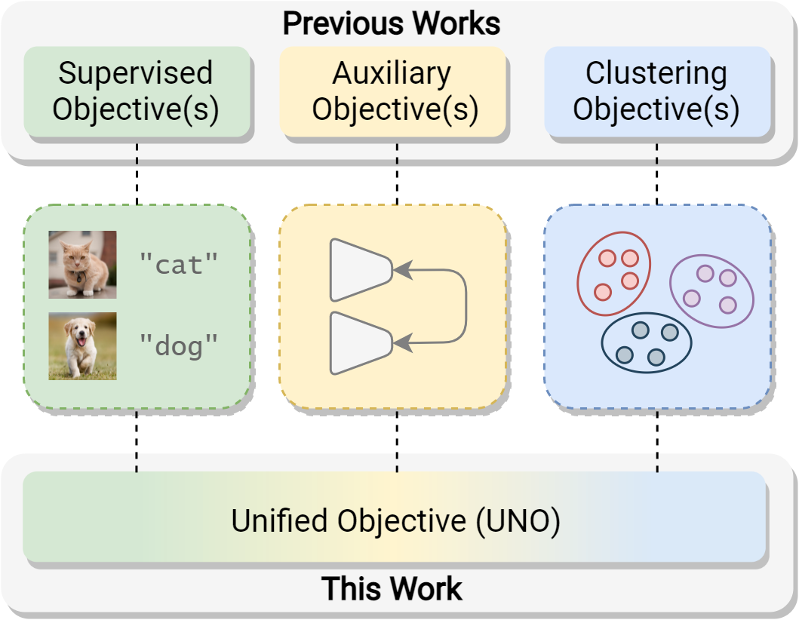
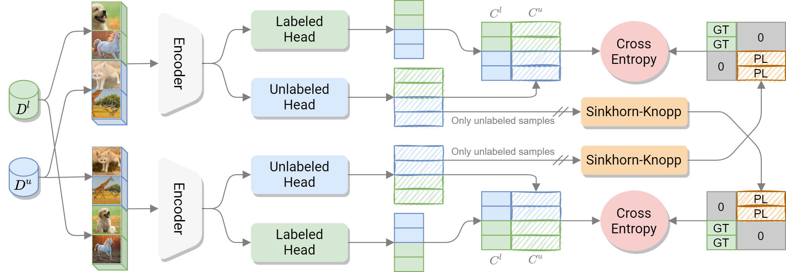

# A Unified Objective for Novel Class Discovery
This is the official repository for the paper:
> **A Unified Objective for Novel Class Discovery**<br>
> [Enrico Fini](https://scholar.google.com/citations?user=OQMtSKIAAAAJ&hl=en), [Enver Sangineto](https://scholar.google.com/citations?user=eJZlvlAAAAAJ&hl=en), [Stéphane Lathuilière](https://scholar.google.com/citations?user=xllguWMAAAAJ&hl=en), [Zhun Zhong](https://scholar.google.com/citations?user=nZizkQ0AAAAJ&hl=en), [Moin Nabi](https://scholar.google.com/citations?user=31seHAMAAAAJ&hl=en), [Elisa Ricci](https://scholar.google.com/citations?user=xf1T870AAAAJ&hl=en)<br>
> **ICCV 2021 (Oral)**

> Paper: [ArXiv](https://arxiv.org/abs/2108.08536)<br>
> Project Page: [Website](https://ncd-uno.github.io/)

> **Abstract:** *In this paper, we study the problem of Novel Class Discovery (NCD). NCD aims at inferring novel object categories in an unlabeled set by leveraging from prior knowledge of a labeled set containing different, but related classes. Existing approaches tackle this problem by considering multiple objective functions, usually involving specialized loss terms for the labeled and the unlabeled samples respectively, and often requiring auxiliary regularization terms. In this paper we depart from this traditional scheme and introduce a UNified Objective function (UNO) for discovering novel classes, with the explicit purpose of favoring synergy between supervised and unsupervised learning. Using a multi-view self-labeling strategy, we generate pseudo-labels that can be treated homogeneously with ground truth labels. This leads to a single classification objective operating on both known and unknown classes. Despite its simplicity, UNO outperforms the state of the art by a significant margin on several benchmarks (+10% on CIFAR-100 and +8% on ImageNet).*
<br>
<p align="center">
     <br />
    <em>
    A visual comparison of our UNified Objective (UNO) with previous works.
    </em>
</p>
<br>
<p align="center">
     <br />
    <em>
    Overview of the proposed architecture.
    </em>
</p>
<br>

# News
**[Oct 6 2021]** A new version of UNO is available in this repository (UNO v2), with the following changes:
* Improved augmentations (similar to [this repository](https://github.com/facebookresearch/suncet))
* Added multi-crop
* Noticed longer training increases performance
* Bugfix (thanks to [DeepTecher](https://github.com/DeepTecher))

With these improvements we could drastically increase the clustering accuracy:
| Method     | CIFAR100-20 | CIFAR100-50 |
|------------|:-----------:|:-----------:|
| RS+        |     75.2    |     44.1    |
| Jia et al. |     76.4    |      -      |
| NCL        |     86.6    |      -      |
| UNO        |     85.0    |     52.9    |
| UNO v2     |     **90.6**    |     **60.8**    |

# Installation
Our implementation is based on [PyTorch](https://pytorch.org) and  [PyTorch Lightning](https://www.pytorchlightning.ai/). Logging is performed using [Wandb](https://wandb.ai/site). We recommend using `conda` to create the environment and install dependencies:
```
conda create --name uno python=3.8
conda activate uno
conda install pytorch==1.7.1 torchvision==0.8.2 cudatoolkit=XX.X -c pytorch
pip install pytorch-lightning==1.1.3 lightning-bolts==0.3.0 wandb sklearn
mkdir -p logs/wandb checkpoints
```
Select the appropriate `cudatoolkit` version according to your system. Optionally, you can also replace `pillow` with [`pillow-simd`](https://github.com/uploadcare/pillow-simd) (if your machine supports it) for faster data loading:
```
pip uninstall pillow
CC="cc -mavx2" pip install -U --force-reinstall pillow-simd
```
**NOTE**: make sure you install the versions of the packages that are listed in the commands, otherwise you might fail in reproducing the results.

# Datasets
For CIFAR10 and CIFAR100 you can just pass `--download` and the datasets will be automatically downloaded in the directory specified with `--data_dir YOUR_DATA_DIR`.
For ImageNet you will need to follow the instructions on this [website](https://image-net.org/download.php).

# Checkpoints
All checkpoints (after the pretraining phase) are available on Google Drive. We recommend using `gdown` to download them directly to your server. First, install `gdown` with the following command:
```
pip install gdown
```
Then, open the [Google Drive folder](https://drive.google.com/drive/folders/1lhoBhT3a--TyvdB2eL-mM2n6I4Kg_qrB?usp=sharing), choose the checkpoint you want to download, do right click and select `Get link > Copy link`. For instance, for CIFAR10 the link will look something like this:
```
https://drive.google.com/file/d/1Pa3qgHwK_1JkA-k492gAjWPM5AW76-rl/view?usp=sharing
```
Now, remove `/view?usp=sharing` and replace `file/d/` with `uc?id=`. Finally, download the checkpoint running the following command:
```
gdown https://drive.google.com/uc?id=1Pa3qgHwK_1JkA-k492gAjWPM5AW76-rl
```

To help you out, we have ready-to-run commands to download the models here (if the Google Drive token changes, you can refer above to see how to create these links):
```
gdown https://drive.google.com/uc?id=1Pa3qgHwK_1JkA-k492gAjWPM5AW76-rl
gdown https://drive.google.com/uc?id=1b81XTMU93Qat5inHeva4R8_GCdaJ3lGr
gdown https://drive.google.com/uc?id=1PZcvIZw0VpEKQQdw3zmR6vC-OWX2LMqI
gdown https://drive.google.com/uc?id=1MKl9g-BAfrroC7zTAhJuW2LQ0Wo8KBF8
```

# Logging
Logging is performed with [Wandb](https://wandb.ai/site). Please create an account and specify your `--entity YOUR_ENTITY` and `--project YOUR_PROJECT`. For debugging, or if you do not want all the perks of Wandb, you can disable logging by passing `--offline`.

# Commands
### Pretraining
Running pretraining on CIFAR10 (5 labeled classes):
```
python main_pretrain.py --dataset CIFAR10 --gpus 1  --precision 16 --max_epochs 200 --batch_size 256 --num_labeled_classes 5 --num_unlabeled_classes 5 --comment 5_5
```
Running pretraining on CIFAR100-80 (80 labeled classes):
```
python main_pretrain.py --dataset CIFAR100 --gpus 1 --precision 16 --max_epochs 200 --batch_size 256 --num_labeled_classes 80 --num_unlabeled_classes 20 --comment 80_20
```
Running pretraining on CIFAR100-50 (50 labeled classes):
```
python main_pretrain.py --dataset CIFAR100 --gpus 1 --precision 16 --max_epochs 200 --batch_size 256 --num_labeled_classes 50 --num_unlabeled_classes 50 --comment 50_50
```
Running pretraining on ImageNet (882 labeled classes):
```
python main_pretrain.py --gpus 2 --num_workers 8 --distributed_backend ddp --sync_batchnorm --precision 16 --dataset ImageNet --data_dir PATH/TO/IMAGENET --max_epochs 100 --warmup_epochs 5 --batch_size 256 --num_labeled_classes 882 --num_unlabeled_classes 30 --comment 882_30
```

### Discovery
Running discovery on CIFAR10 (5 labeled classes, 5 unlabeled classes):
```
python main_discover.py --dataset CIFAR10 --gpus 1 --max_epochs 500 --batch_size 512 --num_labeled_classes 5 --num_unlabeled_classes 5 --pretrained PATH/TO/CHECKPOINTS/pretrain-resnet18-CIFAR10.cp --num_heads 4 --comment 5_5 --precision 16 --multicrop --overcluster_factor 10
```
Running discovery on CIFAR100-20 (80 labeled classes, 20 unlabeled classes):
```
python main_discover.py --dataset CIFAR100 --gpus 1 --max_epochs 500 --batch_size 512 --num_labeled_classes 80 --num_unlabeled_classes 20 --pretrained PATH/TO/CHECKPOINTS/pretrain-resnet18-CIFAR100-80_20.cp --num_heads 4 --comment 80_20 --precision 16 --multicrop --overcluster_factor 5
```
Running discovery on CIFAR100-50 (50 labeled classes, 50 unlabeled classes):
```
python main_discover.py --dataset CIFAR100 --gpus 1 --max_epochs 500 --batch_size 512 --num_labeled_classes 50 --num_unlabeled_classes 50 --pretrained PATH/TO/CHECKPOINTS/pretrain-resnet18-CIFAR100-50_50.cp --num_heads 4 --comment 50_50 --precision 16 --multicrop
```
Running discovery on ImageNet (882 labeled classes, 30 unlabeled classes)
```
python main_discover.py --dataset ImageNet --gpus 2 --distributed_backend ddp --sync_batchnorm --precision 16 --data_dir PATH/TO/IMAGENET --max_epochs 60 --base_lr 0.2 --warmup_epochs 5 --batch_size 256 --num_labeled_classes 882 --num_unlabeled_classes 30 --num_heads 4 --pretrained PATH/TO/CHECKPOINTS/pretrain-resnet18-ImageNet.cp --imagenet_split A --comment 882_30-A --overcluster_factor 4 --multicrop
```
**NOTE**: to run ImageNet split `B`/`C` just pass `--imagenet_split B/C`.

# Citation
If you like our work, please cite our [paper](https://arxiv.org/abs/2108.08536):
```
@InProceedings{fini2021unified,
    author    = {Fini, Enrico and Sangineto, Enver and Lathuilière, Stéphane and Zhong, Zhun and Nabi, Moin and Ricci, Elisa},
    title     = {A Unified Objective for Novel Class Discovery},
    booktitle = {Proceedings of the IEEE/CVF International Conference on Computer Vision (ICCV)},
    year      = {2021}
}
```
